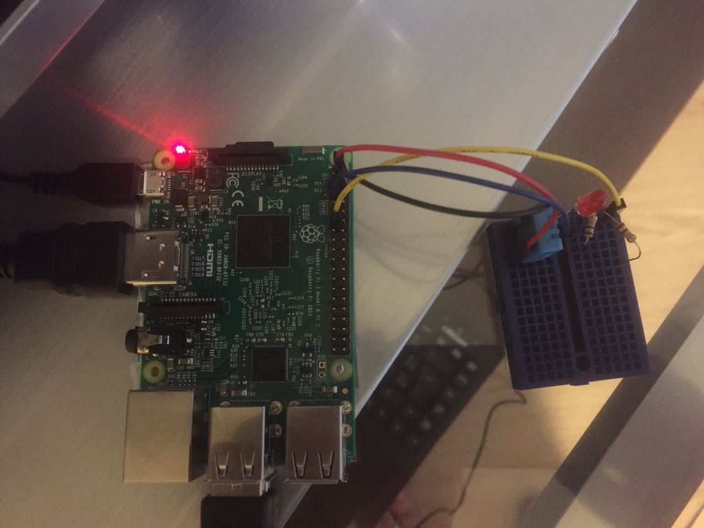
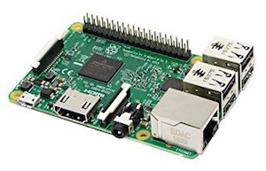
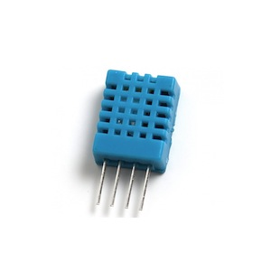
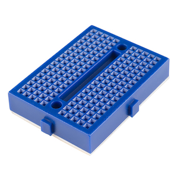
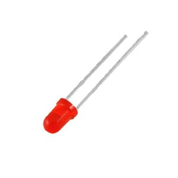
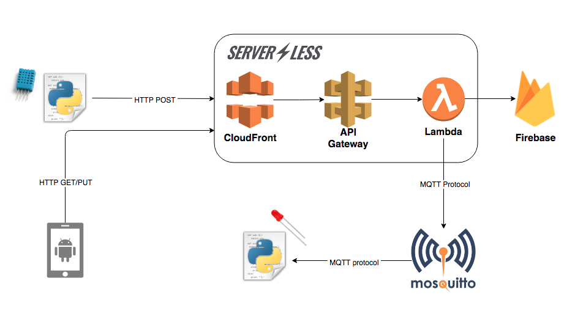
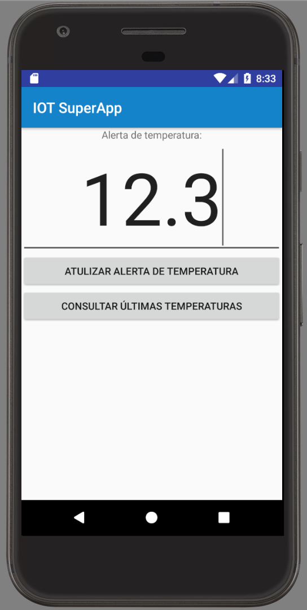
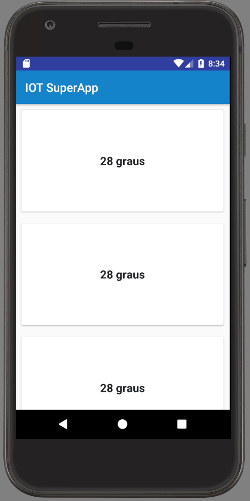

# 29aso-iot-projeto-final
> Projeto construído como solução final para matéria de Arquitetura em Plataforma Mobile & IoT do MBA em Arquitetura de Soluções da faculdade FIAP

## Objetivo

O objetivo é a construção de um projeto prático simples que utilize todos os recursos abordados em sala de aula. 

Optamos por desenvolver um protótipo onde a temperatura e humidade ambiente serão medidas por um sensor e enviadas para uma base de dados em cloud através de uma chamada a uma API REST. 

O serviço que recebe as medições de temperatura verificará se a mesma excedeu o limite configurado e enviará uma mensagem a um tópico do `broker mosquitto`. Caso a temperatura seja maior ou igual ao limite configurado a mensagem será `ON` e caso contrário `OFF`.

Há um código para controle do led que através de um `subscribe` no tópico acima mencionado, recebe as mensagens que chegam ao tópico e acende o led quando recebe uma mensagem `ON` ou apaga quando recebe a mensagem `OFF`.

A ideia é bem simples e foi pensado única e exclusivamente com o intuito de utilizar todas as tecnologias e protocolos vistos em aula.



## Solução

Nessa seção explicaremos em detalhes as tecnologias e equipamentos utilizados no desenvolvimento da solução.

### Equipamentos utilizados

* 1 | [Raspberry Pi 3B](https://www.raspberrypi.org/products/raspberry-pi-3-model-b/)



* 1 | [Sensor Dht11](https://medium.com/dyi-electronics/raspberry-pi-and-dht11-humidity-sensor-cccf6b3072ad)



* 1 | Breadboard Modular



* 1 | Led



* 2 | Resistor


* 4 | Jumpers


### Arquitetura



Fazendo um paralelo entre o desenho da arquitetura acima apresentado e a estrutura organizacional desse repositório temos:

* [backend-api/](#backend-api): diretório onde se encontra os códigos fonte dos serviços da API REST contruída na arquitetura serverless com a linguagem nodejs.
* [iot/](#iot): diretório onde encontramos os programas responsáveis pelo controle do sensor de temperatura e também do led. Esses programas foram desenvolvidos em linguagem python.
* [superapp/](#superapp): diretório onde se encontram os códigos fonte do aplicativo desenvolvido para a plataforma Android.

#### backend-api

API REST com serviços utilizados para centralizar a comunicação entre os componentes da solução.

Uma documentação mais detalhada dos serviços expostos por essa api pode ser encontrada acessando o link https://platform.serverless.com/services/mcamendola/backend-api-29aso-iot.

##### Dependências

* Node version 8.9
* [Serverless Framework](https://serverless.com)

Para instalar o serverless framework, utilize o comando abaixo:

```bash
npm install -g serverless
```

##### Rodando o projeto em ambiente local

Clone esse repositório em sua máquina:

```bash
git clone git@github.com:mcamendola/29aso-iot-projeto-final.git
```

Entre no diretório [backend-api/](./backend-api) e execute o seguinte comando:

```bash
npm run offline
```

Um servidor local será configurado em sua máquina e os serviços estarão disponíveis a partir da url `http://localhost:3000`.

Para conseguir simular em ambiente local o API Gateway e o Lambda da AWS, utilizamos um plugin do framework serverless conhecido como [serverless-offline plugin](https://github.com/dherault/serverless-offline).

##### Deploy dos serviços na AWS

Para realizar o deploy dos serviços em uma conta AWS, basta executar o seguinte comando:

```bash
npm run deploy:dev
```

Esse comando na verdade executará outra sequência de comandos, presente na linha 7 do arquivo [package.json](./backend-api/package.json).

```bash
npm i; AWS_PROFILE=personal sls deploy --stage dev
```

Repare na presença da variável `AWS_PROFILE=personal`. Ao definir essa variável, estamos dizendo para o serverless framework realizar o deploy dos serviços na conta AWS cujas credenciais de acesso estão configuradas no profile `personal` do arquivo de credenciais da AWS.

```
## ~/.aws/credentials

[personal]
aws_access_key_id=YOUR_DEV_ACCOUNT_KEY_ID
aws_secret_access_key=YOUR_DEV_ACCOUNT_ACCESS_KEY
```

#### iot

Dentro do diretório `iot` encontramos outro diretório chamado `raspberrypi`, organização proposta em virtude de estarmos utilizando a placa Raspberry Pi 3 para o desenvolvimento do protótipo.

```
|- raspberrypi/
|--- led.py
|--- requirements.txt
|--- temperature.py
```

##### Dependências

No arquivo [requirements.txt](./iot/raspberrypi/requirements.txt) encontramos algumas libs necessárias para execução dos programas [led.py](#led.py) e [temperature.py](#temperature.py).

* [paho-mqtt](https://pypi.python.org/pypi/paho-mqtt/1.1): implementação do protocolo MQTT 3.1 e 3.1.1.
* [requests](http://docs.python-requests.org/en/master/): biblioteca python para chamadas a APIs REST utilizando o protocolo HTTP.

Além das dependências listadas no arquivo `requirements.txt`, precisamos utilizar uma biblioteca para integração com o sensor `Dht11`. Essa biblioteca se chama `Adafruit_Python_DHT` e os passos para instalação estão descritos no comando abaixo:

```bash
git clone https://github.com/adafruit/Adafruit_Python_DHT.git
sudo python setup.py install
```

##### led.py

No arquivo `led.py` encontramos a codificação necessária para realizarmos um `subscribe` no tópico do Mosquitto e dependendo da mensagem recebida acender ou apagar o led.

`IMPORTANTE: ` utilizamos uma versão aberta do mosquitto disponível a partir do `host: iot.eclipse.org`. Esse broker é recomendado apenas para fins de estudo e testes, pois, não é seguro utilizá-lo em ambiente de produção.

##### temperature.py

O arquivo `temperature.py` faz uso da lib `Adafruit_Python_DHT` para resgatar a temperatura e a humidade capturada pelo sensor e, então, realiza um POST dessa informação para o serviço descrito acima na seção [backend-api](#backend-api).

#### superapp

O aplicativo foi desenvolvido utilizando os principais frameworks e bibliotecas para aplicativos Android.

```
|- app/
|--- src/
|------ main/
|--------- br/com/fiap/iot/superapp/
|------------ adapter/
|------------ api/
|------------ event/
|------------ model/
|------------ ui/
```

* 1 | Caso de uso - Atualização de alerta de temperatura


* 2 | Caso de uso - Lista com as últimas temperaturas



##### Retrofit

[Retrofit](http://square.github.io/retrofit/) é uma das mais poderosas e populares bibliotecas de HTTP Client para Android e Java, produzida pela Square Inc. e lançada como open source para toda comunidade.

Um dos princípios do Retrofit é a simplicidade, que permite que não nos preocupemos com toda a complexidade de criar uma conexão Web Service, uma vez que grande parte de sua correspondente lógica é abstraída. Com toda essa proposta, devemos apenas implementar algumas interfaces, anotar alguns métodos e voilà!

##### Butter Knife

[ButterKnife](http://jakewharton.github.io/butterknife/) é uma biblioteca que simplifica o acesso as `Views` de nossos layouts XML, em nossos app Android, por meio de annotations. 

Desenvolvida pelo já conhecido Jake Wharton a lib ButterKnife, além de simplificar o acesso as `Views`, nos permite vincular listeners as `Views` sem a necessidade de classes anônimas e implementação de interfaces.

##### EventBus

Construindo um aplicativo Android que tem várias componentes ativos que comunicam uns com os outros pode se tornar tedioso. Para economizar tempo, os desenvolvedores muitas vezes acabam com componentes fortemente acoplados em seus aplicativos. [EventBus](http://greenrobot.org/eventbus/) é uma biblioteca open-source popular que foi criado para resolver esse problema usando o padrão publisher/subscriber.

## Conclusão

No vídeo abaixo é possível ver a solução completa em funcionamento.

* https://youtu.be/bdBhQIeJmhw

## Colaboradores

* Igor Gabriel da Silva (RM: 48325)
* Murilo Cezar Amêndola de Oliveira (RM: 30356)
* Lucas Henrique Ferreira (RM: 48727)


